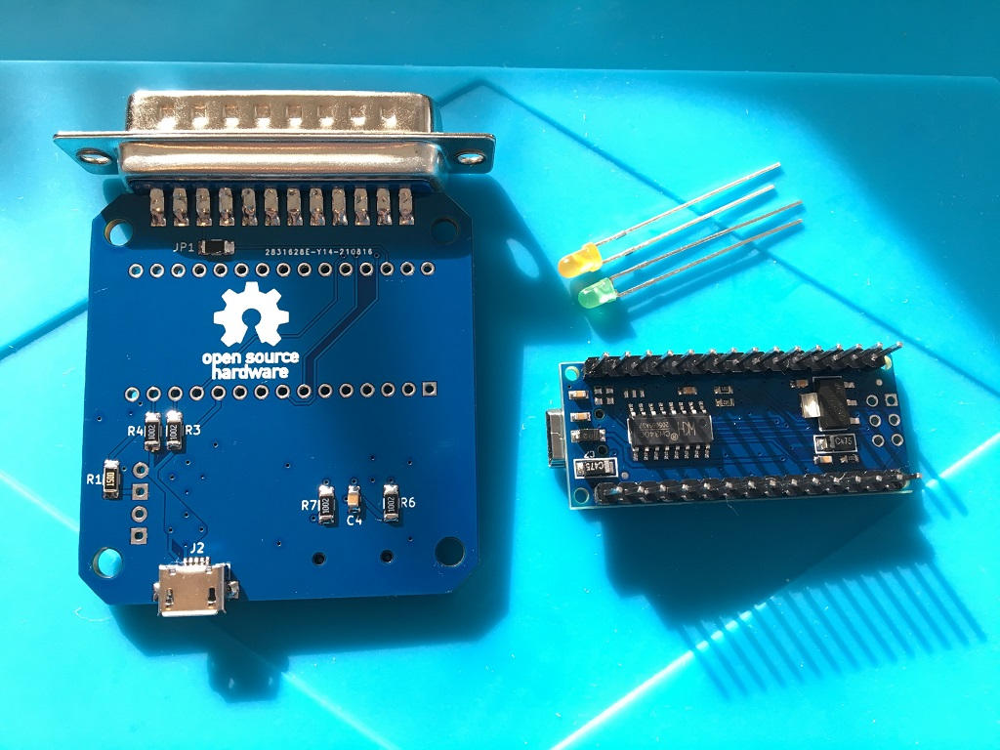
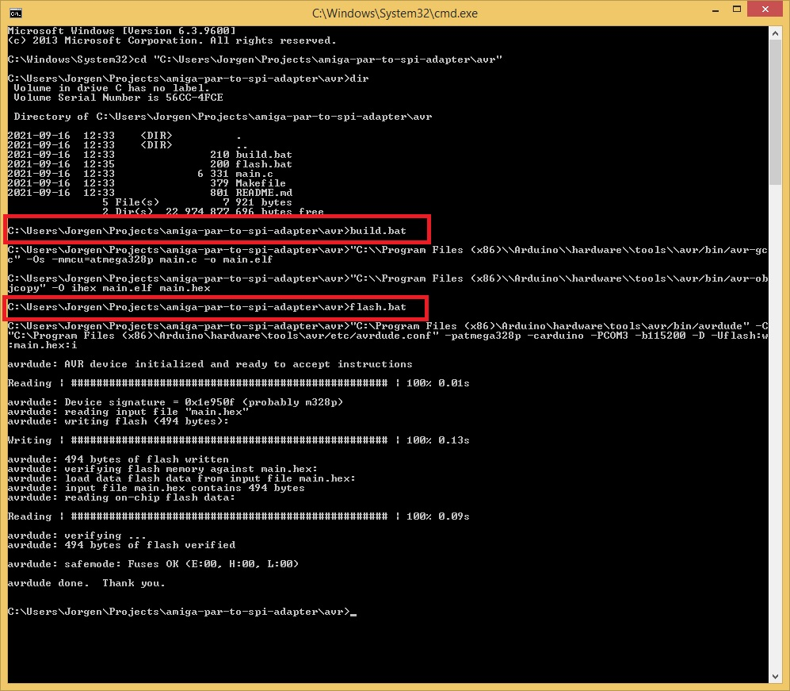
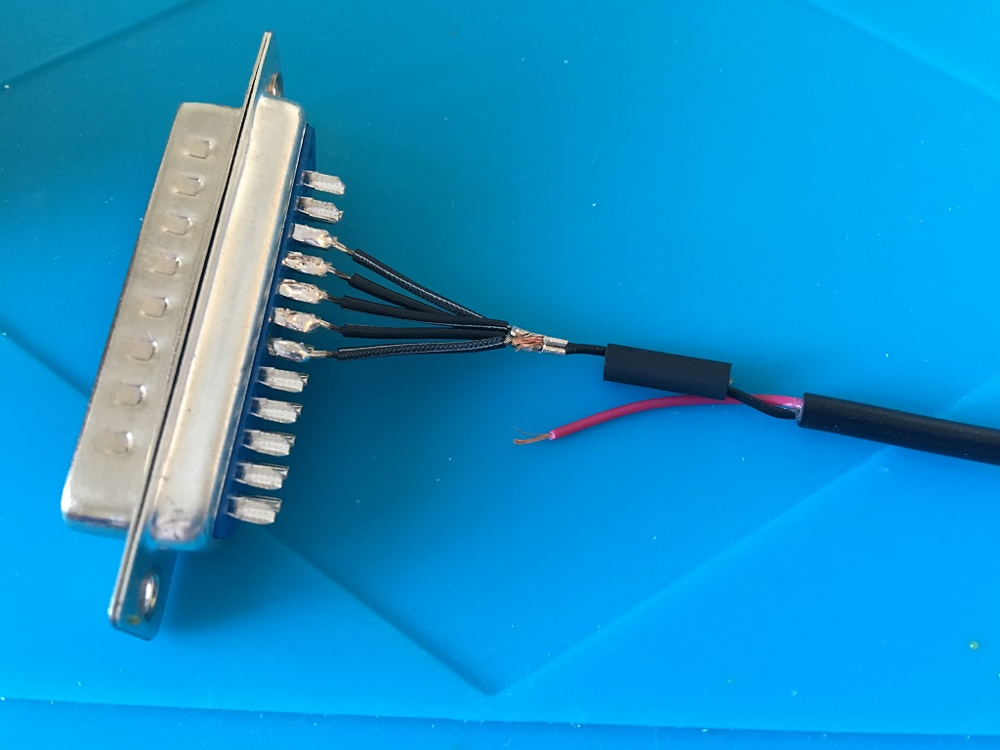

# SDBox v2
***
SDBox v2 for Amiga, hardware compatible with the new updated card-detect (insert/eject interrupt) firmware written by N.Ekström available here: https://github.com/niklasekstrom/amiga-par-to-spi-adapter
***

 

 

***

### Howto build the SDBox Rev2...

***

Start by soldering the `U2` and `U3` ICs, then the passives, the card holder, micro-usb jack, DB25M and so on, nothing complicated, but do skip the ICSP-header if you are going to house this in a case...

***

***

At this stage, before you solder the Nano in place, you should verify that `+5V` via the Micro-USB jack looks ok...

***

***

Now the Nano, validate `+5V` and `+3.3V` looks ok at the Nano:

Powering the MicroSD card directly from the 3.3V-pin of the Arduino, are you nuts?

Well, typical SD card current consumption is `~30mA` in SPI mode.
The Arduino Nano taps `3.3V` from the internal LDO `3V3OUT` supply of the `FT232RL` USB-chip, or in case of the clones the `CH340` USB-chip. 

    FT232RL: Up to 50mA can be drawn from this pin to power external logic if required.
    CH340G: Maximum output current is 30mA, and that voltage stays rather stable up to about 30mA.
***

***

Time to build and flash the firmware:

***

 

***

And we need to 3D-print a case for it before we put the LEDs in:

(STL-files available in the DSM folder)

***

***

Final result:
 

***

Comparison with `v1`, look at the difference in size:
 

***

Now time to build the new `spisd.device` driver, add `+kick13` to the `build.bat` if default is set to build for AmigaOS 2.0...

(`VBCC` for Windows I downloaded from here (Thanks: Leffmann for the installer), https://eab.abime.net/showthread.php?t=83113 )

***

***

BOM Rev. 2A
---------
Position  | Name/Value   | Package | Notes
-|-|-|-|
U1 | Arduino Nano V3 | |
U2 | 74LVC3G17 | TSSOP-8_3x3mm_P0.65mm | Triple non-inverting Schmitt trigger with 5V tolerant input https://www.digikey.se/product-detail/en/nexperia-usa-inc/74LVC3G17DP-125/1727-5998-1-ND/2753830
U3 | 74LVC1G17 | 5-TSSOP, SC-70-5, SOT-353  (2.0 mm × 1.25mm) | Single non-inverting Schmitt trigger https://www.digikey.se/product-detail/en/nexperia-usa-inc/74LVC1G17GW-125/1727-4117-1-ND/1965408
J1 | D-Sub DB25M | DB25 Male connector with solder lugs | DB25 for Amiga parallel port
J2 | Micro USB connector | USB Micro B SMT | For +5V Power, (style 1)  https://www.aliexpress.com/item/32991869539.html
J3 | Micro SD Card Holder | 9-pin Micro SD card slot connector | https://www.aliexpress.com/item/32802051702.html
D1 (Optional) | LED 3mm | PinHeader_1x02_P2.54mm_Vertical, pin pitch 2.54 mm | SD Activity LED indicator, Diffused Orange / Amber, 1.8V-2.3V, 20-30 mA, 605-610nm
D2 (Optional) | LED 3mm | PinHeader_1x02_P2.54mm_Vertical, pin pitch 2.54 mm | Power LED indicator, Green Diffused T-1, 25 mcd, 565 nm, 2.2 V, 25 mA
R1 (Optional) | 150 Ohm Resistor | 1206 SMD, 200 mW | (Mandatory if D1 populated) Series resistor for D1 LED, adjust R-value to your type of LED and preferred brightness
R2 (Optional) | 150 Ohm Resistor | 1206 SMD, 200 mW | (Mandatory if D2 populated) Series resistor for D2 LED, adjust R-value to your type of LED and preferred brightness
R3 | 10k Ohm Resistor | 1206 SMD | Pull-up (to VCC) resistor for /SS
R4 (Optional) | 10k Ohm Resistor | 1206 SMD | Pull-up (to VCC) resistor for MOSI
R5 | 10k Ohm Resistor | 1206 SMD | Pull-up (to 3V3) for MISO_3V3
R6 | 10k Ohm Resistor | 1206 SMD | Pull-up (to 3V3) for DAT1 pin 8 on MicroSD-holder
R7 | 10k Ohm Resistor | 1206 SMD | Pull-up (to 3V3) for DAT2 pin 1 on MicroSD-holder
JP1 (Optional) | 0 Ohm Resistor, or Solder Blob | 1206 SMD | Populate this one to reset Nano in conjunction with Ctrl-Amiga-Amiga
C1 | 220uF Capacitor | SMD-Tantalum, 4.3 x 7.3 x 2.8 mm | Capacitor for VIN +5V Power via USB https://www.reichelt.com/se/en/smd-tantalum-220-f-10v-125-c-t491d-220u-10-p206492.html
C2 | 0.1uF = 100nF Capacitor | 0805 SMD | Decoupling capacitor for U2
C3 | 0.1uF = 100nF Capacitor | 0805 SMD | Decoupling capacitor for U3
C4 | 0.1uF = 100nF Capacitor | 0805 SMD | Decoupling capacitor for J3

***

### Howto get 5V from the Amigas external floppy port _(250 mA max)_, let's make a cable...

 

***
I did't have a `DB23` Male connector so I used a `DB25` and cut it down to a 23 with a hacksaw. I cut on the left side (pin 1 and 14) so that the plug will clear the neighbouring RCA-jack when plugged into the A500 external floppy drive port.
***

***
Remove pin 1 and 14, wiggle back and forth with a plier until they exhaust and snap then pull out the remains from the other side
***

***
Cut and wirestrip the micro-usb cable. Verify polarity, normally black is GND and red is +5V but the cable mfg might have mixed up the wire colours so check with a multimeter to be certain. Pin 3-7 on the connector is GND on the Amiga, +5V is on pin 12. You could either Blob pin 3-7 together (requires quite a lot of solder) and then solder the micro-usb GND-wire to that Blob or do as I did below with 5 individual wires soldered and crimped together.
***

***
Some shrink tube on, a bit overkill maybe but hey it's a guide, no shortcuts, I even crimped and soldered the GND-joint :)
***

***
Ready to go and it clears both the RCA-plug and the serial port connector. With this cable now plugged into the SDBox it'll be powered on as soon as the Amiga is powered on and vice versa.
***

***

Happy Hackin'

